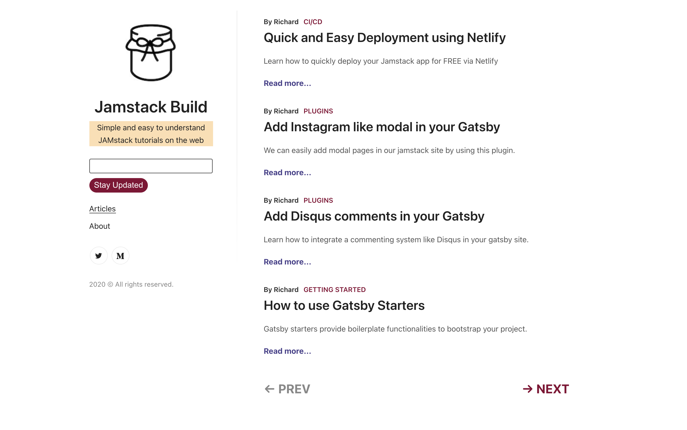

# Jamstack Build

Your source for simple and easy to understand JAMstack tutorials on the web.

## Contributing

If you've got an improvement, just send in a pull request. If you've got feature ideas, simply [open a new issues](https://github.com/chardmd/jamstackbuild/issues/new)!

## Author

Richard Dimalanta [https://chardmd.com](http://chardmd.com)
